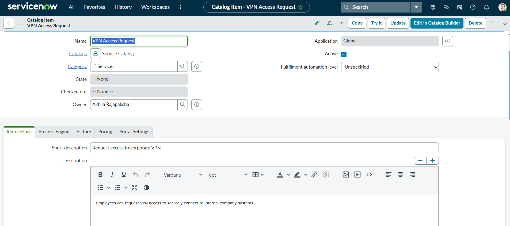
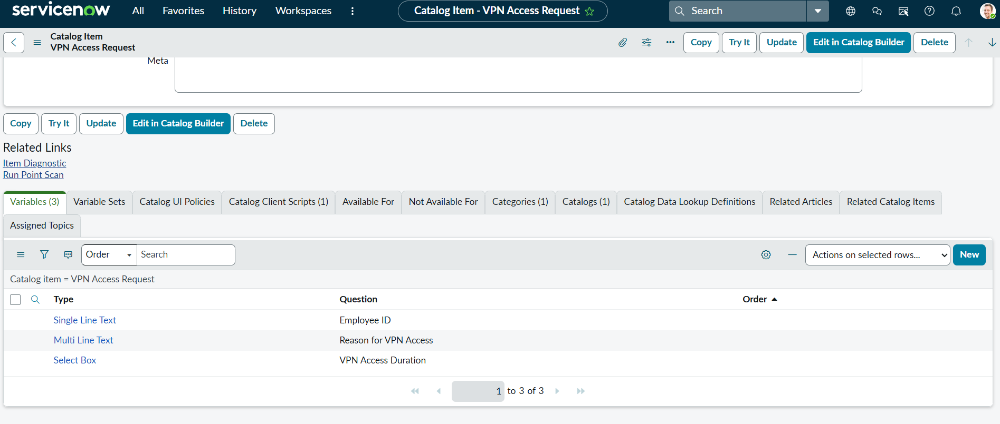
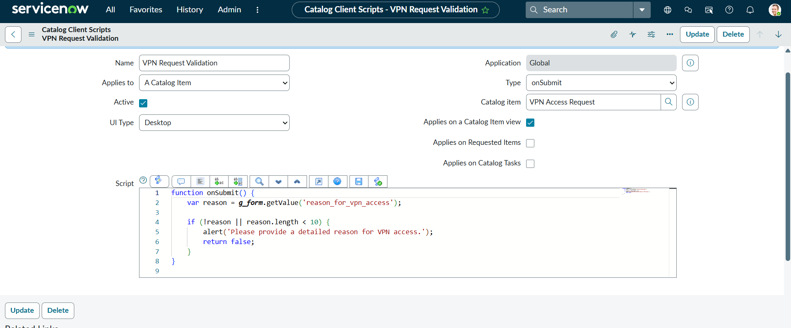
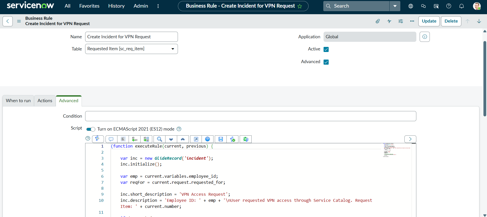
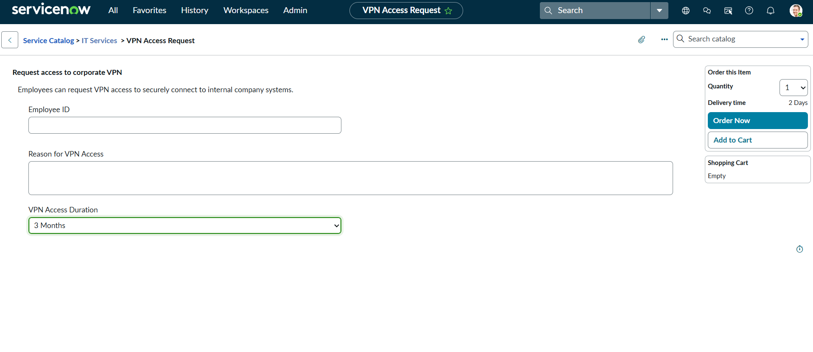
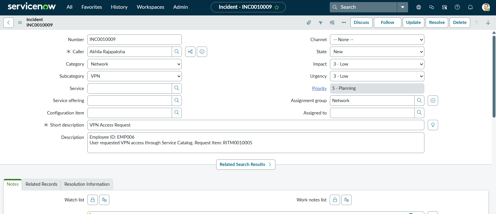

# ServiceNow VPN Access Request Automation

This project demonstrates a ServiceNow ITSM workflow that automates VPN access requests using the Service Catalogue.

## Project Overview

Employees often need VPN access to connect securely to internal company systems.  
This project simulates a real-world ServiceNow workflow where users request VPN access through the Service Catalogue, and the system automatically generates an incident for IT support.

## Features

- Service Catalogue Item for VPN access requests
- Form variables for user input
- Client Script validation using JavaScript
- Business Rule automation
- Automatic Incident creation
- Assignment to the Network support group

## Workflow

User submits VPN request  
↓  
Service Catalogue collects request details  
↓  
Client Script validates the form  
↓  
Business Rule triggers automation  
↓  
Incident is automatically created  
↓  
Incident is assigned to the Network Support team  

## Technologies Used

- ServiceNow
- JavaScript
- ITSM (Incident Management)
- Service Catalogue
- Business Rules
- Client Scripts

## Screenshots

### Catalogue Item


### Variables


### Catalogue Client Script


### Business Rule


### Request Form


### Incident Created Automatically



## Example Automation Script

```JavaScript
(function executeRule(current, previous) {

var inc = new GlideRecord('incident');
inc.initialize();

var emp = current.variables.employee_id;
var reqFor = current.request.requested_for;

inc.short_description = 'VPN Access Request';
inc.description = 'Employee ID: ' + emp + '\nUser requested VPN access through Service Catalog. Request Item: ' + current.number;

if (reqFor) {
inc.caller_id = reqFor;
}

inc.category = 'network';
inc.subcategory = 'vpn';
inc.impact = 3;
inc.urgency = 3;
inc.assignment_group.setDisplayValue('Network');

inc.insert();

})(current, previous);
